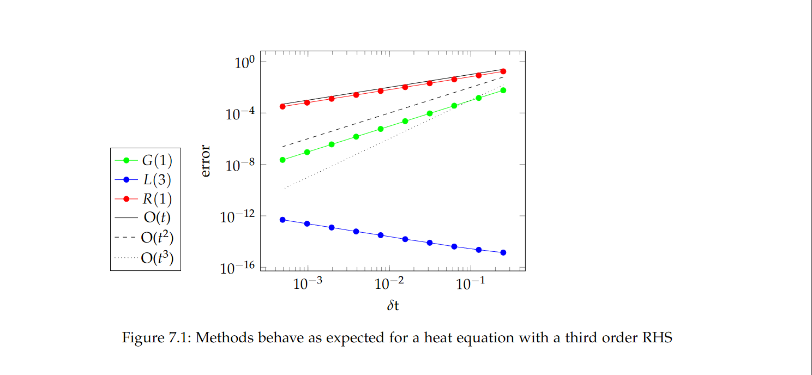
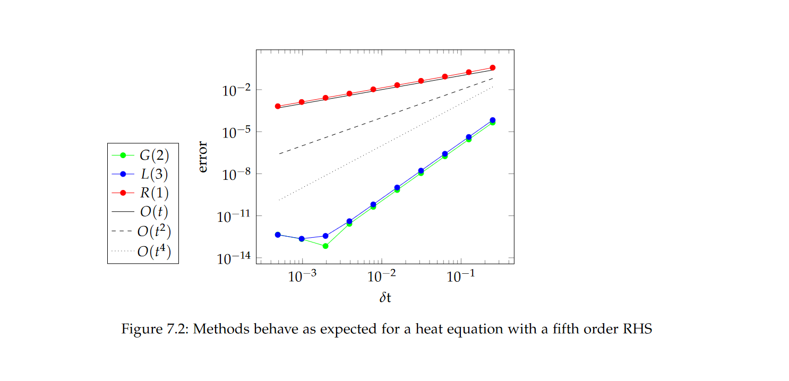
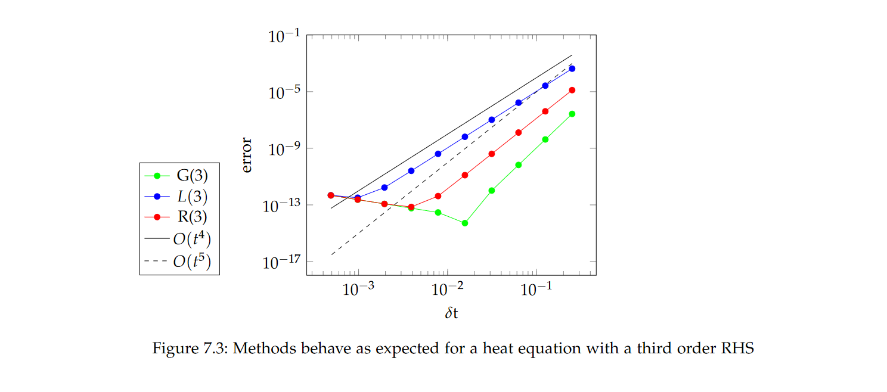

# FenicsIrksome

This project gives a simpliefied version for FEniCS of the Firedrake package Irksome which automates Runge-Kutta methods for solving partial differential equations with the finite element method.

# Running the code

There are several files that can be run solving either the 1D-advection equation or the heat equation. advectionHeun.py solves the 1D-advection equation with Heun's method, advectionImplicitEuler.py with the implicit Euler method.
The heat equation can be solved with all RungeKutta methods with the file heatIrksome.py. One needs to specify the butchertableau. Thereby the ones from Irksome/ButcherTableuax.py can be used
Run the code by typing ```python3 <filename>```. You need numpy and FEniCS for executing the code. Output files with experimental results are created. 

# Convergence Study

This code can be used to perform convergence studies with konvergenzHeat.py.   

## Parameter set 

If you clone this repository, you can directly perform the experiments  with the respective parameters:

* maximum simulation time **T** = 1/32
* largest timestep **tau_0** = 1/128
* considered timestep sizes **tau_i** = [1/128, 1/256, 1/512, 1/1024, 1/2048]

The plots below are created from the modified parameter set.

## Experimental Series 1

Heat equation with a third order RHS solved with the second order Gauss-Legendre method with one stage (G(1)), the fourth order Lobatto IIIc method with three stages (L(3)) and the first order Radau IIa method with one stage (R(1)).



## Experimental Series 2

Heat equation with a fourth order RHS solved with the sixth order Gauss-Legendre method with three stages (G(3)), the fourth order Lobatto IIIc method with three stages (L(3)) and the fifth order Radau IIa method with three stage (R(3)).



## Experimental Series 3

Heat equation with a seventh order RHS solved with the second order Gauss-Legendre method with one stage (G(1)), the fourth order Lobatto IIIc method with three stages (L(3)) and the first order Radau IIa method with one stage (R(1)).



# Reference

If you want to refer to this code, please use the following reference:

[1] Wullenweber, N. (2021). High-order time stepping schemes for solving partial differential equations with FEniCS. [url](https://mediatum.ub.tum.de/604993?query=wullenweber&show_id=1621360&srcnodeid=604993)
